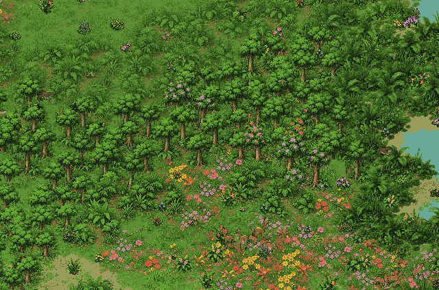

# ∞ Infinite Jungle ([mo.town/jungle](https://mo.town/jungle))

**MIT License** - Copyright 2026 Mohit Cheppudira

An endlessly scrolling animated isometric pixel-art jungle with vegetation, birds, animals, etc. See it live at: [https://mo.town/jungle](https://mo.town/jungle).

Built in TypeScript with **no runtime dependencies**, using WebGL, Canvas fallback and a real headless RGBA renderer. Independent agent classes and bounded procedural-world libraries sit alongside the reusable isometric components. Everything runs as a static site.



[Still image](docs/preview.png) · Regenerate with `npm run readme:preview`.

## Quickstart

Requires **Node.js 22+ and npm**.

```sh
npm ci
npm run dev
```

Open **http://localhost:4173** for the full-screen jungle. **Click the jungle or press Enter / Return to show or hide the compact bottom menu.** Only the mute button is visible initially, in the top right. Tap the scene on touchscreens to show or hide the menu; double-tap to show it. The GitHub icon opens the [official repository](https://github.com/0xfe/jungle) in a new tab. The menu fades after 3 seconds unused and stays visible while Settings or Help is open; `?` opens Help even while the menu is hidden. This builds assets/code and starts a local static server. It doesn't watch files: rebuild and refresh after edits. Use `PORT=8080 npm run serve` for another port.

```sh
npm run build          # deterministic assets, typecheck, bundle → dist/
npm run serve          # serve the existing build
npm run check          # build, headless tests, PNG/JSON snapshots
npm run stats          # build, test coverage, code/asset sizes → artifacts/stats.json
npm run spacecraft:preview # ship/alien contact sheets and complete encounter sequences
npm run test:coverage  # headless coverage → coverage/index.html (uses existing assets)
npm run benchmark      # streaming, simulation, composition and batching profiles
npm run assets:preview # animal direction/action contact sheets
npm run plants:preview # all tree and understory forms
npm run motion:preview # close-up supported monkey swing sequence
npm run elephants:preview # staged drinking / spraying pose review
npm run audio:preview  # generated stereo sound previews
npm run volcanoes:preview # volcano forms, lava and cartoon wildlife effects
npm run volcanoes:preview -- --motion # animated lava preview
npm run patches:preview # generated landscape groups and their trunk templates
```

The stats command prints line counts, headless test coverage, asset and bundle sizes, and decoded atlas memory. It also saves JSON, HTML coverage and LCOV reports; see [statistics and measurement details](docs/TESTING.md#project-statistics).

## Deployment

Copy `dist/` to any static host, including a subdirectory. Source artwork is included; normal builds need no image-generation service, API key, CDN, external font or backend. Development dependencies are TypeScript, esbuild, tsx, sharp, c8 and Node types.

Deploy with `./upload.sh dev` to `muthanna.com/jungle-dev/` or `./upload.sh prod` to `muthanna.com/jungle/`. Each command builds first, uploads hashed assets with a one-day TTL, then publishes the index with a five-minute TTL. Add `--clean` to prune the selected environment after a six-minute cache/loading grace period. With no environment, the script prints help. npm aliases: `npm run upload:dev` and `npm run upload:prod -- --clean`. See [deployment and cache details](docs/DEPLOYMENT.md), including cleanup/concurrency limits and local cache previews.

To change application defaults, edit [src/config.ts](src/config.ts), then rebuild. It covers startup, camera, density, wildlife probabilities, audio (including every individual sound), rendering and cache limits. See [configuration details](docs/CONFIGURATION.md).

The browser console prints a startup banner and repository link, followed by an expandable report after the first frame: package version, Git revision/commit date and modified status (unknown without Git), config SHA-256, effective seed/settings, renderer, camera/audio state, initial world counts, cache budgets and atlas statistics. Identical source builds retain identical metadata; the date is the commit date, not the build time.

## Explore

| Key / gesture | Action |
| --- | --- |
| Click / tap / `Enter` / `Return` | Show or hide the bottom menu (hidden by default) |
| Arrows / WASD / drag | Travel without an island boundary; drift resumes 3 seconds after navigation ends |
| Shift + arrows / WASD | Travel faster |
| `J` | Cycle all 25 animal habitats; briefly pause camera drift (whales surface intermittently) |
| `N` | Visit dry scrub, meadow, lake, forest, then a stream |
| `V` | Visit the nearest rare active volcano |
| `Shift+U` | Cycle saucer → lander → scout; call or visit that design (resumes simulation) |
| `U` | Watch a rare spacecraft clearing; stops drift until P resumes it |
| `O` / Settings | With overlays visible: adjust vegetation, wildlife, water, lake size, clearings, hills and sound |
| `H` / five quick touchscreen taps | Toggle hidden artifact likelihood controls |
| `Shift+Z` | Visit a rare zen sanctuary; P resumes travel |
| `?` | Open Help, even with the menu hidden: FPS, per-stage CPU timing, world/cache/memory statistics and expanded, tappable keyboard commands |
| `R` | Generate a new seeded world |
| `1` / `2` / `3` | Rainforest / flowering / wetland preset |
| `T` | Sun / rain / dusk |
| `Space` | Pause or resume simulation and automatic travel |
| `P` | Toggle slow one-way camera drift |
| `+` / `−` / mouse wheel / pinch | Zoom from 65% to 250% |
| `Home` / `0` | Return to the seeded starting forest |
| `G` | Show tile seams |
| `Esc` | Close settings or the field guide |

The field guide commands also work as buttons on mobile and desktop. Tap individual arrows to move one step, or choose a habitat or zoom direction directly.

## Artifacts

### Wildlife

- **Birds:** toucans, macaws and parakeets (parrots), kingfishers, seagulls, hawks and vultures.
- **Predators:** jaguars, wolves and crocodiles.
- **Large herbivores:** deer and fawns, zebras, giraffes and elephants.
- **Primates:** monkeys and orangutans.
- **Other mammals:** black bears and cubs, squirrels, wild boar and beavers.
- **Snakes and amphibians:** solitary boas, smaller striped snakes and toads.
- **Aquatic wildlife:** fish schools and surfacing whales.
- **Decorative insects:** fluttering butterflies and firefly-like glints.

### Trees and canopies

- **Broadleaf trees:** tall tiered crowns, forked and asymmetric crowns, airy young trees and dense mature forms.
- **Palms:** fan palms and feather palms.
- **Banana plants:** broad-leaf clumps, taller forms and young shoots.
- **Flowering and fruiting groves:** colorful blossoms, fruit-bearing crowns and clustered trees with individual trunks.
- **Climbing foliage:** hanging vines and lianas.

### Flowers, bushes and groundcover

- **Flowers:** hibiscus, daisies, blue bellflowers, bird-of-paradise, lavender, red ginger, white starflowers and coral-and-cream wildflower clumps.
- **Shrubs:** rounded small-leaf shrubs, berry bushes, broad-leaf tropical bushes, airy flowering bushes, pink-tipped bushes and cream-blooming bushes.
- **Ferns:** tall feather ferns, low lime-green ferns and overlapping fern thickets.
- **Groundcover:** grasses, meadow tufts, clover, wildflower carpets and leaf litter.
- **Wetland plants:** mossy bank vegetation, reeds, sedges, lily pads and small aquatic plants.
- **Additional source/fixture artwork:** flowering bromeliad rosettes and mushroom-covered rocks, alongside the individual tree and understory forms.

### Landscape and atmosphere

- **Rare space visitors:** silver saucers, amber tripod landers and violet scouts bring distinct alien crews that explore for 15–30 seconds, return aboard and fly away. Landings require clear dry ground and change between visits. Flying saucers and landers spin, scouts bank, and all have detailed hulls, blinking lights, a whistling hum, a flickering glow and space ripples; exploring crews chatter when sound is enabled. Shift+U cycles through the three ship designs. See [spacecraft encounters](docs/SPACECRAFT.md).

- **Terrain:** forest floor, grassy clearings, meadows, dry scrub, sandy shores, muddy banks and gently raised ground.
- **Water:** lakes, ponds and connected flowing streams, with ripples, glints, foam and drifting woody debris.
- **Small details:** fallen leaves, twigs, sparse root litter and weathered bones/hide at vulture feeding spots.
- **Animation and weather:** rooted tree sway, rustling leaves and petals, drifting leaves, rain, dusk light, elephant spray and whale blows.

### Soundscape

- **Environment:** rustling leaves, water, rain and dusk insects.
- **Wildlife:** bird whistles, trills, chatter, gull-like calls, woodpecker-like drumming, footsteps and recorded elephant trumpets.

## Documentation

- [Rare spacecraft, alien crews, landing safety and retained artwork](docs/SPACECRAFT.md)
- [Snake behavior, rigs and tree wrapping](docs/SNAKES.md)
- [Rare volcanoes, lava hazards and replacement wildlife](docs/VOLCANOES.md)
- [Shared landscape artwork, navigation templates and memory](docs/LANDSCAPE-PATCHES.md)
- [Recurring colorful regions, canopy wildlife and black bears](docs/REGIONAL-VARIETY.md)
- [Application defaults and per-sound tuning](docs/CONFIGURATION.md)
- [Elephant anatomy, drinking, play and splash responses](docs/ELEPHANTS.md)
- [Natural forest composition, variety and procedural vines](docs/FOREST.md)
- [Landscape controls and smooth shorelines](docs/SETTINGS.md)
- [Reusable audio library and sound generation](docs/AUDIO.md)
- [Animal rhythm, supported swings and flap/glide flight](docs/ANIMAL-MOTION.md)
- [Herds, new wildlife, tree variety and forest floor](docs/WILDLIFE.md)
- [Library architecture and rendering contracts](docs/DESIGN.md)
- [Independent agents, motion and compact serialization](docs/AGENTS-LIBRARY.md)
- [Procedural terrain, streaming, scrollback, budgets and statistics](docs/STREAMING.md)
- [Animation/model design and research](docs/ANIMATION.md)
- [Sprite sources and reproducible asset generation](docs/ASSETS.md)
- [Performance measurements and tradeoffs](docs/PERFORMANCE.md)
- [Testing, snapshots and debugging](docs/TESTING.md)
- [Strategy and original web research](STRATEGY.md)
- [Contributor/agent instructions](AGENTS.md)

### Zen sanctuaries

Rare red-and-white pagodas have layered tile roofs, grassy flowering gardens, winding muddy paths, lotus ponds, koi, ducks and fishing pelicans. Monks independently meditate, tend different flower beds and enter/leave the temple; a separate group walks around a small grove. **Shift+Z** visits one. **H** or **five quick nearby touchscreen taps** opens the hidden artifact-likelihood editor, with expandable groups of sliders. **?** opens the ordinary guide. Changes regrow the same seed and reset scrollback. See [sanctuary design and validation](docs/ZEN.md); `npm run zen:preview` writes scene and individual-artifact previews.
