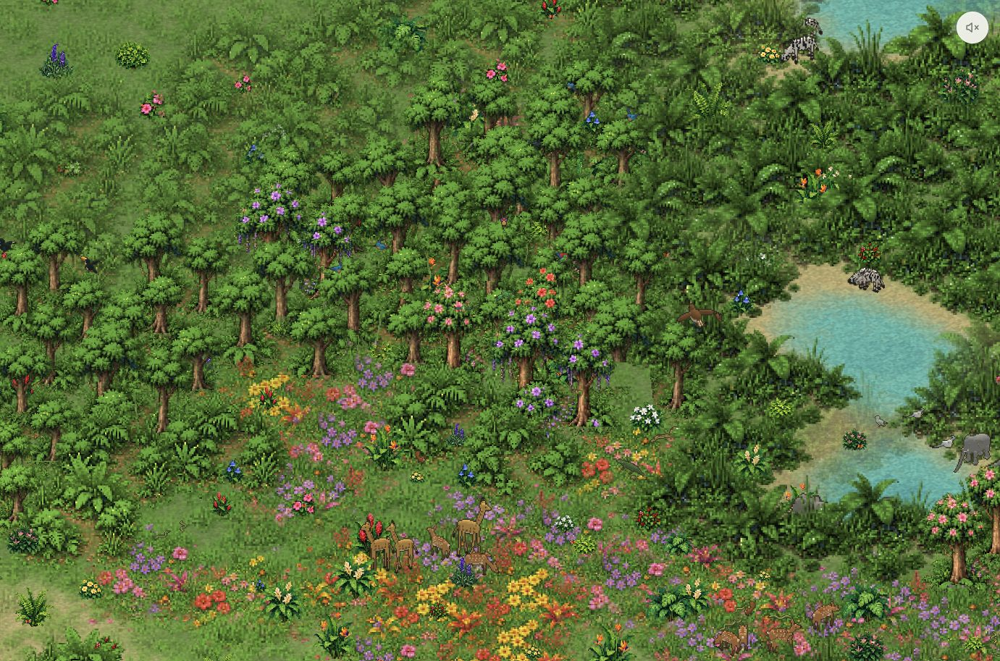

# ∞ Infinite jungle

An endlessly scrolling isometric pixel-art jungle. See it live at: [https://mo.town/jungle](https://mo.town/jungle).

Built in TypeScript with **no runtime dependencies**, using WebGL, Canvas fallback and a real headless RGBA renderer. Independent agent classes and bounded procedural-world libraries sit alongside the reusable isometric components. Everything runs as a static site.



## Quickstart

Requires **Node.js 22+ and npm**.

```sh
npm ci
npm run dev
```

Open **http://localhost:4173** for the full-screen jungle. **Press Enter / Return to show or hide the compact bottom menu.** Only the mute button is visible initially, in the top right. Double-tap the scene on touchscreens to show the menu; `?` opens Help even while the menu is hidden. This builds assets/code and starts a local static server. It doesn't watch files: rebuild and refresh after edits. Use `PORT=8080 npm run serve` for another port.

```sh
npm run build          # deterministic assets, typecheck, bundle → dist/
npm run serve          # serve the existing build
npm run check          # build, headless tests, PNG/JSON snapshots
npm run benchmark      # streaming, simulation, composition and batching profiles
npm run assets:preview # animal direction/action contact sheets
npm run plants:preview # all tree and understory forms
npm run motion:preview # close-up supported monkey swing sequence
npm run elephants:preview # staged drinking / spraying pose review
npm run audio:preview  # generated stereo sound previews
npm run patches:preview # generated landscape groups and their trunk templates
```

Copy `dist/` to any static host, including a subdirectory. Source artwork is included; normal builds need no image-generation service, API key, CDN, external font or backend. Development dependencies are TypeScript, esbuild, tsx, sharp and Node types.

Deploy with `./upload.sh dev` to `muthanna.com/jungle-dev/` or `./upload.sh prod` to `muthanna.com/jungle/`. Each command builds first, uploads hashed assets with a one-day TTL, then publishes the index with a five-minute TTL. Add `--clean` to prune the selected environment after a six-minute cache/loading grace period. With no environment, the script prints help. npm aliases: `npm run upload:dev` and `npm run upload:prod -- --clean`. See [deployment and cache details](docs/DEPLOYMENT.md), including cleanup/concurrency limits and local cache previews.

To change application defaults, edit [src/config.ts](src/config.ts), then rebuild. It covers startup, camera, density, wildlife probabilities, audio (including every individual sound), rendering and cache limits. See [configuration details](docs/CONFIGURATION.md).

## Explore

| Key / gesture | Action |
| --- | --- |
| `Enter` / `Return` | Show or hide the bottom menu (hidden by default) |
| Arrows / WASD / drag | Travel without an island boundary; drift resumes 3 seconds after navigation ends |
| Shift + arrows / WASD | Travel faster |
| `J` | Cycle all 21 animal habitats; briefly pause camera drift (whales surface intermittently) |
| `N` | Visit dry scrub, meadow, lake, forest, then a stream |
| `O` / Settings | With overlays visible: adjust vegetation, wildlife, water, lake size, clearings, hills and sound |
| `?` | With overlays visible: FPS, per-stage CPU timing, world/cache/memory statistics and keyboard guide |
| `R` | Generate a new seeded world |
| `1` / `2` / `3` | Rainforest / flowering / wetland preset |
| `T` | Sun / rain / dusk |
| `Space` | Pause or resume simulation and automatic travel |
| `P` | Toggle slow one-way camera drift |
| `+` / `−` / mouse wheel / pinch | Zoom from 65% to 250% |
| `Home` / `0` | Return to the seeded starting forest |
| `G` | Show tile seams |
| `Esc` | Close settings or the field guide |

**Sound starts muted on every platform:** master 60%, environment 5%, animals 80%. Click or tap the speaker to enable it. Other gestures never undo mute. The top-right speaker button always toggles mute, including with the menu hidden. Independent whistles, trills, chatter and woodpecker-like taps overlap, with occasional recorded elephant trumpets nearby; settings adjust the layers separately. Sound fades when muted, paused or the page is hidden.

Solitary boas move slowly and sometimes coil around tree trunks; smaller striped snakes travel in loose groups with varied body sizes. `J` includes both snake habitats.

Large compound landscapes join groves, bush thickets, grass, wet banks and water into continuous surfaces. Each arrangement owns 16 tiles with overlapping porous borders; the streamed world no longer scatters standalone plant sprites. Recurring open woodland, flowering and fruiting groves, muddy gaps and wetter stretches bring variety beyond the quiet opening. Scattered grassy clearings leave room between dense stands, and continuous rooted wind moves trees, flower carpets and low foliage. Extra crown rustling adapts to load while the broad breeze stays active. Leaves have configurable tint palettes, and grouped trees retain movement/perch templates. See [landscape groups](docs/LANDSCAPE-PATCHES.md).

Auto-scroll now moves at 20 screen pixels per second (25% faster). Menu clicks, sound controls and ordinary taps keep auto-scroll moving. Only navigation (drag, zoom, keyboard travel or a location jump) delays it for three seconds.

Open woodland now has extra deer, small snakes and birds, plus solitary squirrels that climb trees. Colorful canopy birds are more plentiful in dense stands. Black bears are larger and usually forage alone, occasionally as a mother with cubs. Denser cover favors wolves, jaguars and wild boar; deer flee brief boar charges. Small ponds have no fish schools. Streams have tighter muddy banks and wet vegetation; connected streams carry foam and twigs past beavers, bank-basking crocodiles and hopping toads. See [rivers and woodland wildlife](docs/RIVERS.md).

Deer, zebras, jaguars and bears sometimes lie down, breathe quietly, look around and shift position before getting up. Zebras also take occasional runs. Broad predator and prey ranges usually keep them apart; nearby hunters prompt suitable prey to flee. Rare hawks circle overhead and occasionally miss a dive at small animals; vultures spend most of their time picking at weathered remains, with short flights between meals. Sixteen additional animated flower and shrub forms bring varied colors and sizes above the landscape art. See [wildlife refinements](docs/WILDLIFE-REFINEMENTS.md).

The starting forest is deliberately sparse in plants. Travel in any direction gradually reveals denser stands and a different wildlife mix, reaching the full regional density 22 tiles from the seeded starting point. Groves, clearings, lakes and family encounters add variety along the way; revisiting the opening keeps its quiet character.

World sliders regrow the current seed around your camera and reset scrollback. The mature forest uses the 2.5× animal setting; the opening applies a smaller local multiplier; landscape sliders control relative abundance, not exact area percentages. Settings do not survive page reloads.

Each page load or refresh starts a fresh randomly seeded world. Reproduce a location across reloads with `?seed=42&x=-100&y=80` (including seed `0`); the current seed is shown in Help. Empty or invalid seed parameters use the normal startup policy. Reduced-motion preference starts paused; force Canvas with `?renderer=canvas`. The old finite `?density=16` stress mode has been replaced by streamed-world benchmarks and wide-view travel tests.

Scrollback retains compact sleeping agent state until chunks expire. After eviction, terrain and initial populations regenerate from the seed. The default cache caps are **4 MiB / 256 chunks**, with distance expiry. Memory in GB is explicitly an estimate; the optional JS heap reading is separate. Nothing automatically persists across page reloads. A binary checkpoint/restore API is available for future storage adapters.

## Documentation

- [Snake behavior, rigs and tree wrapping](docs/SNAKES.md)
- [Shared landscape artwork, navigation templates and memory](docs/LANDSCAPE-PATCHES.md)
- [Recurring colorful regions, canopy wildlife and black bears](docs/REGIONAL-VARIETY.md)
- [Application defaults and per-sound tuning](docs/CONFIGURATION.md)
- [Elephant anatomy, drinking, play and splash responses](docs/ELEPHANTS.md)
- [Natural forest composition, variety and procedural vines](docs/FOREST.md)
- [Landscape controls and smooth shorelines](docs/SETTINGS.md)
- [Reusable audio library and sound generation](docs/AUDIO.md)
- [Animal rhythm, supported swings and flap/glide flight](docs/ANIMAL-MOTION.md)
- [Herds, new wildlife, tree variety and forest floor](docs/WILDLIFE.md)
- [Library architecture and rendering contracts](docs/DESIGN.md)
- [Independent agents, motion and compact serialization](docs/AGENTS-LIBRARY.md)
- [Procedural terrain, streaming, scrollback, budgets and statistics](docs/STREAMING.md)
- [Animation/model design and research](docs/ANIMATION.md)
- [Sprite sources and reproducible asset generation](docs/ASSETS.md)
- [Performance measurements and tradeoffs](docs/PERFORMANCE.md)
- [Testing, snapshots and debugging](docs/TESTING.md)
- [Strategy and original web research](STRATEGY.md)
- [Contributor/agent instructions](AGENTS.md)

The current prototype has gentle height fields and local herd territories. Cross-chunk animal migration, full ecological lifecycles, general pathfinding, overhangs and durable world persistence remain future work.

Bears now stand and pick at trees, small zebra herds graze in dry woodland, giraffes are taller, and elephant turns/trunk actions have more frames. Flowers, bushes, butterflies and drifting leaves animate over shared landscapes. See [wildlife and landscape refinements](docs/WILDLIFE-REFINEMENTS.md) for behavior, artwork, texture tradeoffs and verification.
